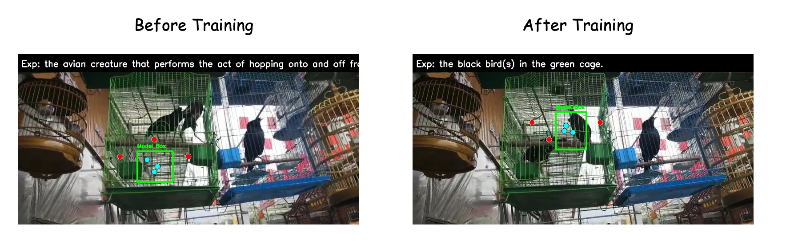

# NegPoint RL/SFT Training Project

NegPoint is a vision-language training project for learning segmentation prompts with reinforcement learning and cold-start supervised fine-tuning. It is built on top of EasyR1/veRL and targets image and video object localization tasks where the model must output positive and negative point prompts for a downstream segmentation model such as SAM2.


## why we do this
Previous works often focus on using positive hints to segment objects. However, when faced with scenes that require the exclusion of certain elements, positive-hint-based models are often at a loss. To address this, we propose Neseg, an agent that leverages both positive and negative hints for object segmentation in videos.

## Cold Start SFT

Cold Start SFT uses the same preprocessed JSON. The default training mode is LoRA; full-parameter fine-tuning can be enabled with `FULL_FINETUNE=true`.

Run SFT on an existing preprocessed file:

```bash
cd site-packages/easyr1

DATA_ROOT=/path/to/Sa2VA-Training \
TRAIN_FILE=preprocess_data/expression.json \
MODEL_PATH=Qwen/Qwen3-VL-4B-Instruct \
bash local_scripts/run_negpoint_sft.sh
```

Optionally run preprocessing before SFT:

```bash
DATA_ROOT=/path/to/Sa2VA-Training \
RUN_PREPROCESS=true \
MAX_SAMPLES=1000 \
bash local_scripts/run_negpoint_sft.sh
```

## Reinforcement Learning

RL training is launched through EasyR1:

```bash
cd site-packages/easyr1

DATA_ROOT=/path/to/Sa2VA-Training \
TRAIN_FILE=preprocess_data/expression.json \
MODEL_PATH=Qwen/Qwen3-VL-4B-Instruct \
bash local_scripts/run_negpoint_rl.sh
```